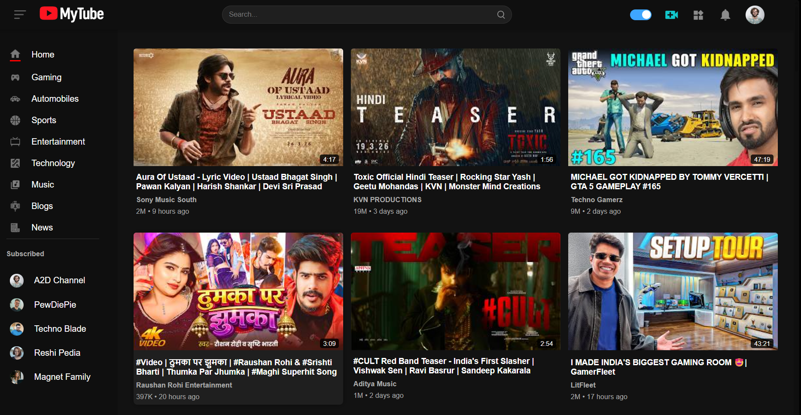
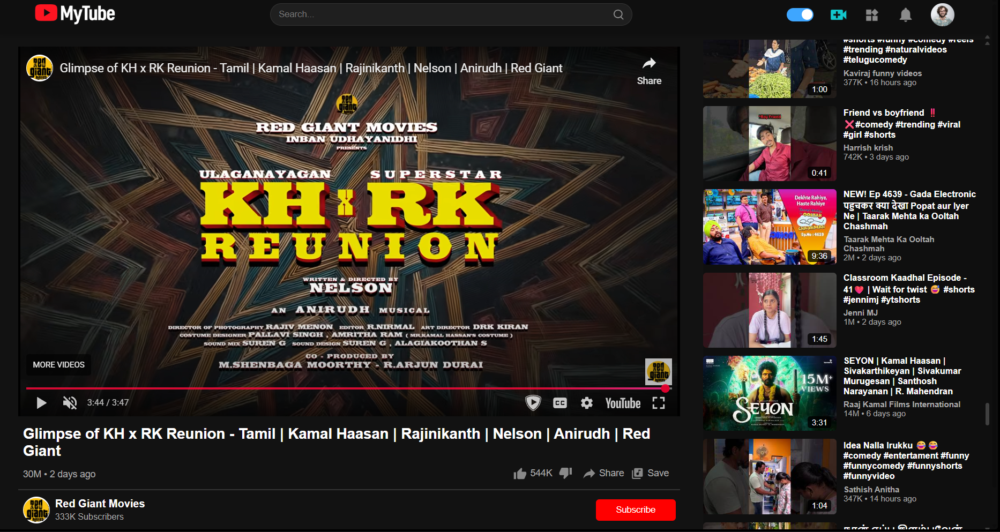

📺 MyTube — YouTube-Style Video Streaming App


MyTube is a YouTube-inspired frontend video streaming web application built using React.js

It replicates the layout and core UI structure of YouTube, including sidebar navigation, video feed, video player page, recommended section, and search functionality.

🌐 Live Demo: https://ar-mytube.vercel.app/

---

## 📸 Screenshots

### 🏠 Home Page



### 🎥 Video Player Page



---

## Project Purpose

This project was built to:

* Strengthen my **React.js and JavaScript** skills
* Practice **component-based architecture**
* Learn **client-side routing using React Router**
* Understand how modern video streaming UIs are structured
* Improve state handling and UI logic implementation

This is a **frontend-only project** focused on UI/UX and structure.

---

## Features

### Home Page

* Video feed layout
* Sidebar navigation (Home, Gaming, Tech, Music, etc.)
* Responsive video grid
* Category-style UI

### Video Player Page

* Embedded video playback
* Video details section
* Like / Dislike / Share / Save UI buttons
* Channel info
* Comment section UI
* Recommended videos section

### Search Page

* Dedicated search layout
* Filtered video display interface

### Navigation & Routing

* Implemented using **React Router DOM**
* Separate routes for:

  * `/` (Home)
  * `/video`
  * `/search`

### UI & Styling

* Clean YouTube-inspired layout
* Custom CSS styling (component-level CSS files)
* Responsive design
* Organized UI structure

---

## Tech Stack

* **React 19**
* **React Router DOM 7**
* **JavaScript (ES6+)**
* **Moment.js** (for time formatting)
* **Vite** (Build tool & development server)
* **Custom CSS**

---

## Responsiveness

MyTube is fully responsive and adapts smoothly across:

* Desktop screens
* Tablets
* Mobile devices

Layout structure adjusts for smaller screen sizes by optimizing sidebar and video grid display.

---

## Run Locally

1️⃣ Clone the repository:

```bash
git clone https://github.com/Rahumansgit/MyTube.git
```

2️⃣ Navigate into the project:

```bash
cd MyTube
```

3️⃣ Install dependencies:

```bash
npm install
```

4️⃣ Start the development server:

```bash
npm run dev
```

---

## What I Learned

* Structuring large React applications
* Component reusability
* Handling routing between multiple pages
* Organizing assets and UI modules
* Designing complex layouts similar to real-world platforms

---
